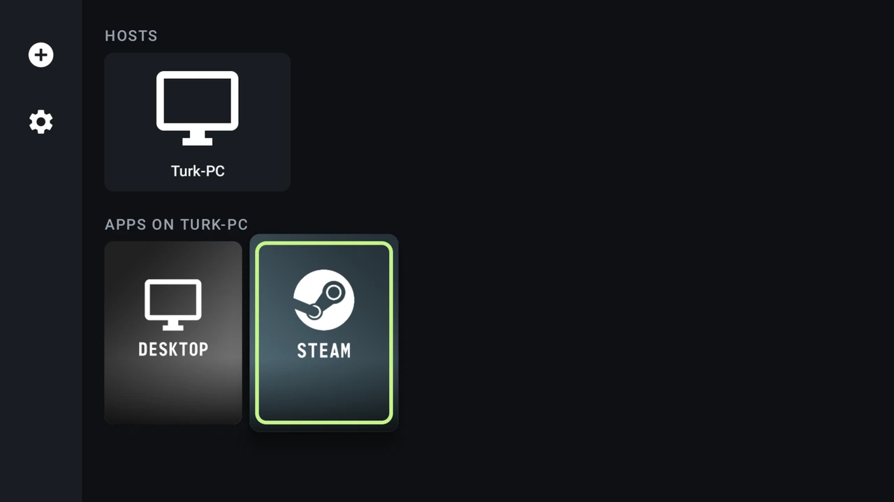
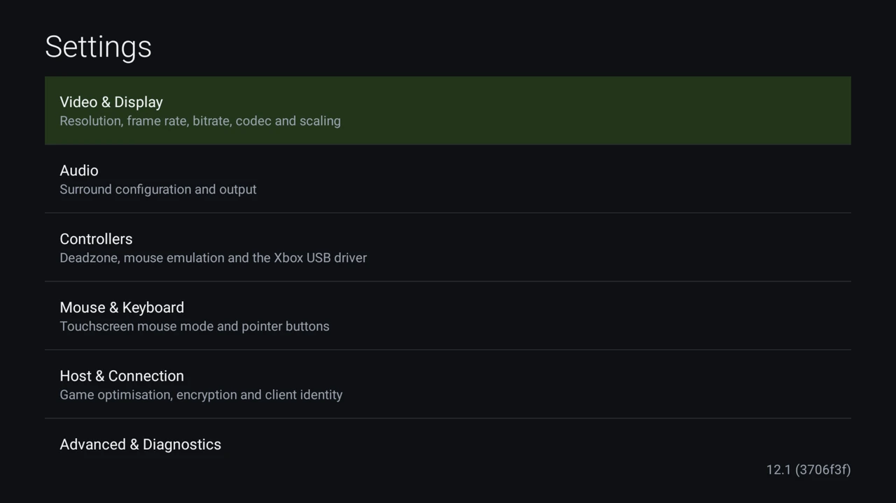
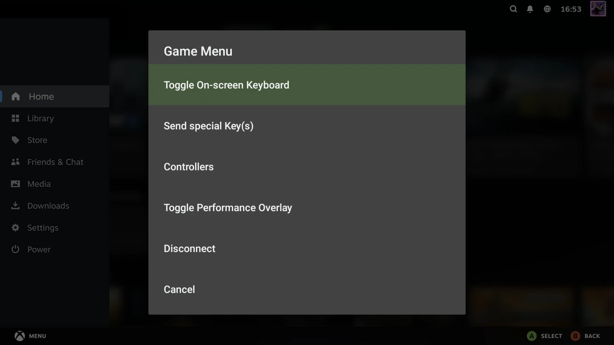
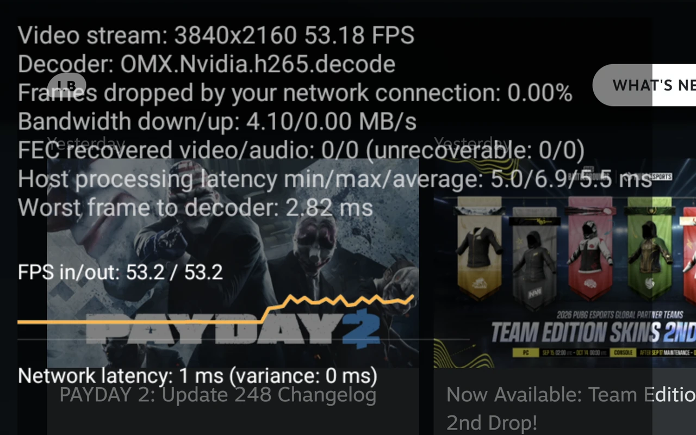
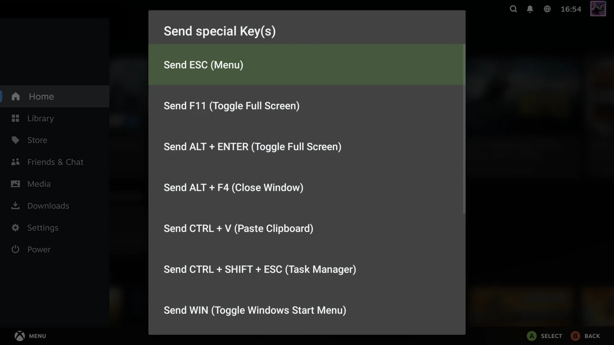
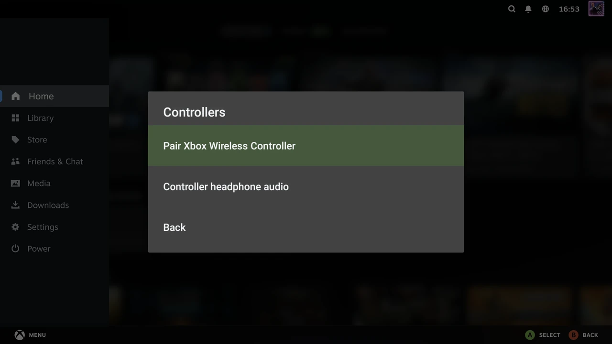

# Moonlight for Android — trexx fork

A fork of [Moonlight for Android](https://github.com/moonlight-stream/moonlight-android), the
open-source client for [Sunshine](https://github.com/LizardByte/Sunshine) and NVIDIA GameStream,
cut down for Android TV boxes and tuned for latency. It runs on any device with **Android 11
(API 30)** or newer and an **ARM CPU** (`arm64-v8a` or `armeabi-v7a`; there is no x86 build),
targets Sunshine hosts, and is English-only.

It is not published to any store. Build it from source (below) or take the signed APK from a
[Build workflow](.github/workflows/build.yml) run. Upstream's own releases are on
[moonlight-stream.org](https://moonlight-stream.org), with a [Discord](https://moonlight-stream.org/discord).

## Screenshots

<table>
  <tr>
    <td></td>
    <td></td>
  </tr>
  <tr>
    <td align="center">Browse — rail, hosts, apps</td>
    <td align="center">Settings — six screens, build in the corner</td>
  </tr>
  <tr>
    <td></td>
    <td></td>
  </tr>
  <tr>
    <td align="center">In-stream menu (Back, or hold Start)</td>
    <td align="center">Performance overlay, toggled mid-stream</td>
  </tr>
  <tr>
    <td></td>
    <td></td>
  </tr>
  <tr>
    <td align="center">Special keys the client would otherwise swallow</td>
    <td align="center">Controllers — pairing and pad headphone audio</td>
  </tr>
</table>

Taken on an Android TV box streaming Steam from Sunshine.

## What this fork changes

### Controllers

* **Xbox Wireless Adapter, natively.** The USB dongle is driven by a GIP driver derived from
  [medusalix/xow](https://github.com/medusalix/xow) (`d335d602`, see
  [`UPSTREAM.md`](app/src/main/jni/xow_driver/UPSTREAM.md)) — no Bluetooth, no root, several
  pads on one adapter. Since the port: fragmented-message reassembly, both security
  handshakes (v1 RSA and v2 ECDH), battery reporting, a guide-LED brightness setting, and
  **stream audio to the pad's headphone jack**, wirelessly or over a cable (isochronous USB),
  toggled per pad from the in-stream menu.
* **Switch Pro Controller over USB with motion.** Gyro, accelerometer and rumble reach the
  host, with factory and user calibration read from the pad's flash. Opt-in: both USB-driver
  settings must be on, otherwise the kernel driver keeps it.
* **More pads recognised.** SDL controller database refreshed (529 → 613 devices, tracked by a
  scheduled CI job), Xbox Series init over USB, 8BitDo Xbox-mode pads, PowerA Pro (Switch)
  matched by name, Steam controllers reported as their own type.

### Streaming and latency

* Picture data is written straight into the decoder's input buffer; the min-latency pacer
  stamps frames with SurfaceFlinger's own clock, so stale frames are dropped instead of
  queued; the output queue is an int ring buffer; ADPF performance hints report the frame's
  work (API 31 and newer).
* Per-controller and per-packet allocation, JNI round-trips and logging are off the hot paths,
  and the overlay is formatted off the decode thread.
* Frame timestamps in microseconds end-to-end; fractional refresh rates (59.94) actually reach
  Sunshine; FEC on [nanors](https://github.com/sleepybishop/nanors).
* HEVC reference-frame invalidation is withheld from Amlogic decoders that corrupt with it;
  AV1 RFI backs off after a decoder crash.
* Settings: **stream encryption** (None / Audio only / Audio and video — it used to be
  silently decided by the CPU), **intra refresh**, and a **per-install client ID** so Sunshine
  can tell clients apart.
* Launches retry, pairing is cancellable, and a malformed app list or a broken `GameManager`
  no longer crashes the app.

### Audio

* **Low-latency AAudio output** (opt-in) for boxes that refuse AudioTrack's fast path — a
  lock-free ring buffer feeding the realtime callback, surround masks passed straight through,
  AudioTrack as the fallback.
* **Continuous audio** (opt-in) keeps a Sunshine host sending during silence, so a quiet stream
  and a dead one no longer look the same.
* libopus 1.6.1.

### UI

* **Browse screen rebuilt** on the platform framework: a rail (Add PC, Settings), a host band
  and one fixed-size app grid, with d-pad focus rings and TV overscan in the layout.
* **In-stream menu** on Back or a held Start: on-screen keyboard, special keys (Esc, F11,
  Alt+Enter, Alt+F4, Ctrl+V, Ctrl+Shift+Esc, Win, Win+D, Win+G, Win+Shift+Left, Shift+Tab),
  controller options, the performance overlay, and Disconnect. **Back no longer ends the
  stream**, and holding Start no longer toggles mouse emulation — both are in the menu now.
* **One menu style everywhere.** Host, app and in-stream menus share one presenter and one row
  size; no input device gets a different form.
* **Settings in six screens** — Video & Display, Audio, Controllers, Mouse & Keyboard, Host &
  Connection, Advanced & Diagnostics — with the build's version and commit in the corner.
* **The on-screen keyboard types keystrokes**, so games see them, with a preview strip that
  echoes the line being typed and host-side text reconciled against what the IME has.

### Diagnostics

* The overlay reports FEC recovery, decrypt failures (only when non-zero), the worst frame of
  the window and host processing latency, and plots FPS in/out and network latency against
  time. It can be toggled mid-stream, and is formatted off the decode thread.
* Debug builds also keep per-frame latency **percentiles** and emit Perfetto trace spans on the
  video path; both are compiled out of release.
* Every stream ends with a summary in the log, not just the ones that crash.

### Under the hood

* **Mbed TLS 3.6.7** on its PSA API replaces OpenSSL 1.1.1 for stream crypto, built from a
  submodule with only AES-CBC, AES-GCM and CTR-DRBG. Hardware AES is compiled in for both
  ABIs, including the ARMv8 extensions in the 32-bit build. Native library: 2.2 MB →
  ~0.4 MB, and 22 MB of prebuilt static libraries left the repository.
* Toolchain: AGP 9.4.0, Gradle 9.6.1, Java 25, NDK r29, compileSdk 37 / minSdk 30 /
  targetSdk 34 (deliberately — API 35 changes insets handling for no benefit to a fullscreen
  client), OkHttp 5.5.0, BouncyCastle 1.86, libusb 1.0.30. Renovate keeps them current.
* Raising minSdk to 30 removed 111 OS-version checks and the rooted build flavour; the branch is
  roughly 48,000 lines lighter than upstream.
* A JVM unit test suite (`./gradlew testDebugUnitTest`) with coverage, run by CI alongside the
  build; CI also reports APK size and DEX method count against master.

### Removed

Each of these was deleted rather than carried:

* mDNS host discovery — PCs are added by address
* Translations — the fork is English-only
* GeForce Experience-specific handling
* Pen and touchscreen input — controller touchpads still work
* The in-app help `WebView`
* The metered-network bitrate
* The system equalizer
* Wake-on-LAN and STUN
* The on-screen virtual controller
* Picture-in-picture, DeX and multi-window
* Phone-vibrator rumble and phone-sensor motion
* The network connection test
* The "small box art" and "Soft keyboard text input" settings

## Building

* Install Android Studio, a JDK 17 or later to run Gradle, and Python 3.
* `git submodule update --init --recursive`
* `git fetch --depth=1 origin '+refs/tags/v*:refs/tags/v*'` — `versionName` comes from the
  highest `v*` tag, and a clone without one fails to configure.
* `./gradlew assembleRelease` (or Android Studio). The JDK 25 toolchain that compiles Java and
  the pinned NDK are downloaded automatically.

**Carried patches.** Upstream fixes this fork needs but that have not merged are kept as diffs
under [`patches/`](patches) and applied to the submodule's working tree before `ndk-build` by
[`scripts/apply-native-patches.py`](scripts/apply-native-patches.py), which runs from
`preBuild` (hence Python). The submodule pointer never moves, so the parent repo still shows
exactly which upstream commit is built against. Currently carried against `moonlight-common-c`
(pinned at `62e0663`):

* Decrypt-failure counters ([`0002`](patches/moonlight-common-c/0002-count-decrypt-failures.patch))
* Atomics for `ConnectionInterrupted` and the blocking queue's size
  ([`0004`](patches/moonlight-common-c/0004-atomic-connection-interrupted.patch))
* The intra-refresh capability ([`0005`](patches/moonlight-common-c/0005-intra-refresh-capability.patch))

## Testing

`./gradlew testDebugUnitTest` runs the JVM tests on any machine, without a device or the NDK.
Everything that touches input, audio or the decoder needs real hardware and a real host;
[`HARDWARE_TESTING.md`](HARDWARE_TESTING.md) is the checklist of what has been verified, on
what, and what is still outstanding. [`CLAUDE.md`](CLAUDE.md) holds the engineering rules —
which paths are hot, what may not be allocated on them, and how to instrument a change.

## Credits

Moonlight is the work of [Cameron Gutman](https://github.com/cgutman),
[Diego Waxemberg](https://github.com/dwaxemberg), [Aaron Neyer](https://github.com/Aaronneyer)
and [Andrew Hennessy](https://github.com/yetanothername), students at
[Case Western](http://case.edu), and was started as a project at [MHacks](http://mhacks.org).
Moonlight also has a [PC client](https://github.com/moonlight-stream/moonlight-qt) and an
[iOS/tvOS client](https://github.com/moonlight-stream/moonlight-ios).

The Xbox Wireless Adapter driver is derived from [xow](https://github.com/medusalix/xow) by
medusalix, ported to Android by [Hakusai Zhang](https://github.com/xm1994), and first brought
to Moonlight by [summershrimp](https://github.com/summershrimp) in
[moonlight-android#1415](https://github.com/moonlight-stream/moonlight-android/pull/1415)
([branch](https://github.com/summershrimp/moonlight-android/tree/xow-support)). The GIP
protocol work draws on [xone](https://github.com/medusalix/xone) and Microsoft's published
[GIP USB spec](docs/ms-gipusb-spec.pdf).

Backported from upstream Moonlight:
[#1219](https://github.com/moonlight-stream/moonlight-android/pull/1219),
[#1461](https://github.com/moonlight-stream/moonlight-android/pull/1461),
[#1478](https://github.com/moonlight-stream/moonlight-android/pull/1478),
[#1516](https://github.com/moonlight-stream/moonlight-android/pull/1516),
[#1565](https://github.com/moonlight-stream/moonlight-android/pull/1565),
[#1582](https://github.com/moonlight-stream/moonlight-android/pull/1582); from
moonlight-common-c: [#97](https://github.com/moonlight-stream/moonlight-common-c/pull/97),
[#147](https://github.com/moonlight-stream/moonlight-common-c/pull/147); and from
ClassicOldSong's Artemis fork:
[#571](https://github.com/ClassicOldSong/moonlight-android/pull/571), with
[#567](https://github.com/ClassicOldSong/moonlight-android/pull/567) diagnosing the AudioTrack
fast-path problem (see also upstream issues
[#1423](https://github.com/moonlight-stream/moonlight-android/issues/1423),
[#1238](https://github.com/moonlight-stream/moonlight-android/issues/1238) and
[#1161](https://github.com/moonlight-stream/moonlight-android/issues/1161)).
